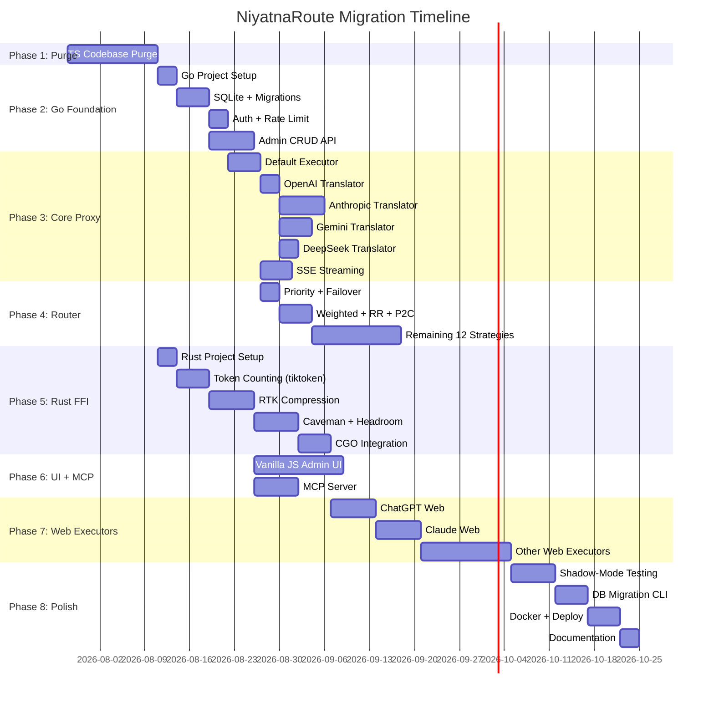

# Migration: Realistic Timeline

## Overview
Honest timeline for the full NiyatnaRoute migration from TypeScript/Next.js to Go+Rust. Not the 4-week fantasy — a real engineering estimate.

## Phase Summary

## Detailed Phase Breakdown

### Phase 1: TS Codebase Purge — 2 weeks
| Task | Days | Parallel? |
|------|------|-----------|
| ChaosMode + Evals purge | 2 | — |
| Batches + A2A purge | 2 | — |
| Electron + Gamification purge | 1 | — |
| Notion + Discovery purge | 2 | — |
| Dashboard + API routes purge | 3 | — |
| Config + Scripts cleanup | 1 | — |
| Verification sweep | 1 | — |
| **Subtotal** | **12 days** | |

### Phase 2: Go Foundation — 3 weeks
| Task | Days | Parallel? |
|------|------|-----------|
| Go project scaffold + CI | 3 | — |
| SQLite schema + migrations | 5 | — |
| Auth middleware + rate limiter | 3 | After DB |
| Admin CRUD API (providers, combos, keys) | 7 | After DB |
| **Subtotal** | **18 days** | |

### Phase 3: Core Proxy — 4 weeks
| Task | Days | Parallel? |
|------|------|-----------|
| Default executor + HTTP proxy | 5 | — |
| OpenAI translator (passthrough) | 3 | After executor |
| Anthropic translator (complex) | 7 | ↕ Parallel |
| Gemini translator | 5 | ↕ Parallel |
| DeepSeek translator | 3 | ↕ Parallel |
| SSE streaming engine | 5 | After executor |
| **Subtotal** | **28 days** | ~18 effective |

### Phase 4: Router — 3 weeks
| Task | Days | Parallel? |
|------|------|-----------|
| Priority + Failover + RR | 3 | — |
| Weighted + P2C + Latency | 5 | — |
| Remaining 11 strategies | 14 | — |
| **Subtotal** | **22 days** | |

### Phase 5: Rust FFI — 4 weeks (parallel with Phase 3-4)
| Task | Days | Parallel? |
|------|------|-----------|
| Rust project + cargo setup | 3 | — |
| tiktoken-rs integration | 5 | — |
| RTK compression engine | 7 | — |
| Caveman + Headroom | 7 | — |
| CGO binding + cross-compile | 5 | — |
| **Subtotal** | **27 days** | |

### Phase 6: UI + MCP — 3 weeks (parallel with Phase 4-5)
| Task | Days | Parallel? |
|------|------|-----------|
| Vanilla JS admin UI (8 pages) | 14 | — |
| MCP SSE server (15 tools) | 7 | — |
| **Subtotal** | **21 days** | |

### Phase 7: Web Executors — 4 weeks
| Task | Days | Parallel? |
|------|------|-----------|
| ChatGPT Web (TLS + cookie) | 7 | — |
| Claude Web | 7 | — |
| DeepSeek/Grok/Cursor/Others | 14 | — |
| **Subtotal** | **28 days** | |

### Phase 8: Polish — 3 weeks
| Task | Days | Parallel? |
|------|------|-----------|
| Shadow-mode testing | 7 | — |
| DB migration CLI | 5 | — |
| Docker + fly.toml + systemd | 5 | — |
| Documentation | 3 | — |
| **Subtotal** | **20 days** | |

## Total Timeline

| Path | Duration |
|------|----------|
| Critical path (sequential) | ~6 months |
| With parallelism (2 devs) | ~4 months |
| **Realistic estimate** | **4-5 months** |

## Milestones

| Milestone | Target Date | Criteria |
|-----------|------------|---------|
| M1: Purge Complete | Week 2 | TS codebase clean, typecheck passes |
| M2: Go Proxy MVP | Week 8 | OpenAI passthrough works end-to-end |
| M3: Multi-Provider | Week 12 | Anthropic + Gemini translators working |
| M4: Full Router | Week 14 | All 17 strategies ported |
| M5: Rust FFI | Week 16 | Compression + token counting via FFI |
| M6: Admin UI | Week 16 | 8-page vanilla JS dashboard |
| M7: Web Executors | Week 20 | ChatGPT + Claude web sessions working |
| M8: Production Ready | Week 22 | Shadow-tested, Docker image, docs |
